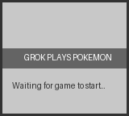

# Grok Plays Pokémon

A web-based experience where Grok (an AI) plays Pokémon Red autonomously via an API-controlled emulator, with visitors watching the gameplay live.



## Overview

**Grok Plays Pokémon** is inspired by the "Twitch Plays Pokémon" phenomenon but with a twist: instead of humans collaboratively controlling the game, an AI (Grok) makes all the gameplay decisions. Visitors to the website can watch the game in real-time, read Grok's commentary on its strategy, and see game statistics as they evolve.

This project consists of:
- PyBoy emulator running Pokémon Red
- Python backend that interfaces with the emulator
- Flask web server for API and streaming
- Web frontend for visitors to watch the game

## Features

- **Live Game Streaming**: Watch Grok play Pokémon Red in real-time
- **AI Commentary**: Read Grok's thoughts on strategy and decision-making
- **Game Stats**: View current Pokémon team, items, badges, and more
- **Autonomous Gameplay**: The AI makes all decisions based on game state
- **WebSocket Integration**: Real-time updates without page refreshes

## Requirements

- Python 3.8+
- PyBoy dependencies (see [PyBoy documentation](https://github.com/Baekalfen/PyBoy))
- A legal Pokémon Red ROM file (not included)

## Setup

1. Clone this repository:
   ```
   git clone https://github.com/NYTEMODEONLY/grok-plays-pokemon.git
   cd grok-plays-pokemon
   ```

2. Install dependencies:
   ```
   pip install -r requirements.txt
   ```

3. Place your Pokémon Red ROM in the `roms` directory:
   ```
   mkdir -p roms
   cp /path/to/your/pokemon_red.gb roms/
   ```

4. Run the server:
   ```
   python app.py
   ```

5. Open your browser to `http://localhost:5000`

## Project Structure

- `app.py`: Main Flask application and server
- `emulator.py`: PyBoy integration and game state management
- `grok_controller.py`: Example script for Grok's game control logic
- `templates/`: Frontend HTML templates
- `static/`: CSS, JavaScript, and assets
- `roms/`: Directory for the Pokémon ROM (not included)

## How It Works

1. **Game Emulation**: The PyBoy emulator runs Pokémon Red in the backend
2. **AI Control**: Grok provides gameplay decisions via API calls (e.g., "move up", "use Water Gun")
3. **Execution**: The emulator executes those actions
4. **Streaming**: Game screens and state are streamed to the web frontend via WebSockets
5. **Viewing**: Visitors can watch Grok's gameplay and read its commentary in real-time

## API Endpoints

The following API endpoints are available:

- `GET /api/status`: Get the current emulator status
- `GET /api/state`: Get the current game state (Pokémon, items, etc.)
- `GET /api/screenshot`: Get the current game screen image
- `POST /api/execute_action`: Execute a single game action
- `POST /api/execute_sequence`: Execute a sequence of game actions
- `GET /api/commentary`: Get the commentary history
- `GET /api/start_game`: Start the game emulator
- `GET /api/stop_game`: Stop the game emulator

## Game Actions

The following actions can be sent to the emulator:

- `a`: Press the A button
- `b`: Press the B button
- `start`: Press the Start button
- `select`: Press the Select button
- `up`: Press the Up direction
- `down`: Press the Down direction
- `left`: Press the Left direction
- `right`: Press the Right direction

Example API call:
```
POST /api/execute_action
{
  "action": "a",
  "commentary": "Selecting Squirtle as my starter!"
}
```

## Game State

The game state includes information about:

- Current Pokémon team (species, levels, HP)
- Items in inventory
- Current location
- Badges collected
- Money
- Current battle status (if in battle)

## Contributing

We welcome contributions! See [CONTRIBUTING.md](CONTRIBUTING.md) for guidelines.

## Roadmap

Future plans for the project include:

- Enhanced game state extraction from emulator memory
- Improved AI decision-making for more strategic gameplay
- Battle analysis tools for better combat decisions
- Community features (voting on next moves, suggesting strategies)
- Performance improvements for smoother streaming

## License

This project is licensed under the MIT License - see the LICENSE file for details.

## Acknowledgments

- [PyBoy](https://github.com/Baekalfen/PyBoy) for the Game Boy emulation
- The original Twitch Plays Pokémon for inspiration
- Game Freak and Nintendo for creating Pokémon

## Disclaimer

This project is not affiliated with or endorsed by Nintendo, Game Freak, or The Pokémon Company. Pokémon is a registered trademark of Nintendo. The creators of this project do not distribute any copyrighted ROM files. 